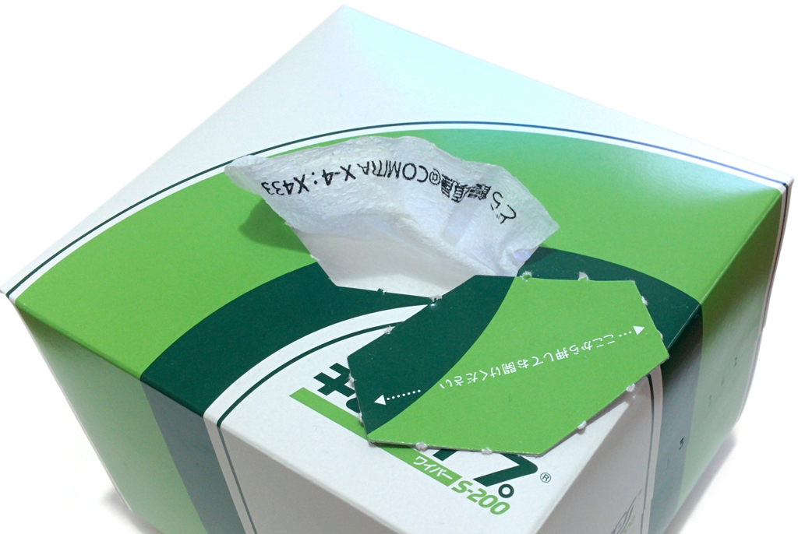
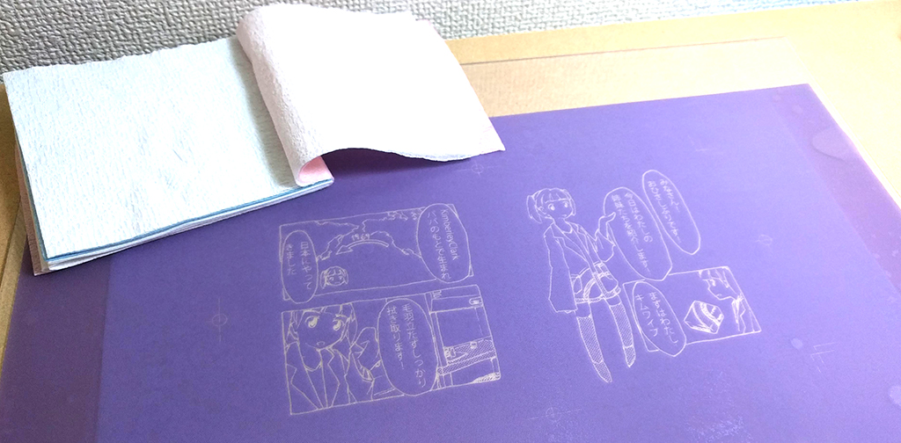

# はじめに

キムワイプに印刷する芸を始めたのはいつの頃だっただろう。
はじめは、簡易なイラストを印刷したフリーペーパー(2014/11/23 COMITIA X-4 で配布 **\figurename\ \ref{fig:first-wipe-print}**)だけであったが、いつの間にやらエスカレートし、キムワイプの本文とキムタオルの表紙に国内版と海外版のキムワイプの違いについて紹介する擬人化マンガを印刷してみたり[1]、今では複数種の紙ウエスにマンガを印刷した同人誌[2]を頒布する始末である。

{width=50%}

本誌では、湿度の低下によるインク濃度の変動や、紙ウエスの品種ごとに大幅に異なるにじみの特性に振り回されながら、4年に渡って試行錯誤を重ねた結果をまとめる。

# 基本編・キムワイプにイラストを刷る

キムワイプのような薄い紙はローラーでの送りが難しいため、一般家庭で実現可能な印刷方式としては、孔版印刷の一種であるスクリーン印刷がおそらく唯一の答えである。
版を制作するための感光スクリーンとしては、**\figurename\ \ref{fig:screen}**に例を示す、太陽精機のTシャツくん ミドルスクリーンが入手しやすい。
ただし、感光スクリーンは経時劣化が早く、製造から時間が立つと、現像不良を引き起こしやすくなる点に注意が必要である。

{width=50%}

スクリーンの線数(網目の細かさ)は、後に説明するように、インクの粘性を高く保つ必要があるため、目詰まりの頻度を下げるためには、比較的粗い80から120線/インチ程度を使用するとよい。
一方、粗い目のスクリーンでは、細い線を再現できないため、原稿作成の際に考慮する必要がある。
Tシャツくんスクリーンの製品としては、線幅1mm以上が推奨されているが、概ね0.5mm以上の線幅があれば、印刷が可能であった。

スクリーンを用いた製版には紫外線を用いた感光が必要であるが、感光時間の調整を行うために、ブラックライトのような一定強度の紫外線を照射できる機材を用意するとよい。
例えば、高さ200mmに10Wの蛍光ランプFL10BLBを2本設置して、80 g/m$^{2}$ の普通紙にレーザープリントしたものを原版とし、厚さ2mmのPET板でおさえた場合、露光時間35分が適正であった。
なお、ガラスやアクリルは紫外線をほとんど吸収するため、版の押さえにはPET樹脂のような紫外線透過率の高いものを用いる。

原版と感光スクリーンの間に隙間があると、像がボケて感光過多になるため、スプレーのり等で接着するとよい。
スプレーのりは、現像時に水につけると容易に剥がれる。
現像の際は、版をこすらずに、シャワーの水圧のみで未露光部分を除去すると、細い線も含めて再現性高く製版できる。
現像後は、再び紫外線を照射し、完全に硬化させることで版の耐久性を高められる。

\begin{figure*}[t]
\centering\includegraphics[width=\linewidth]{images/comparizon.png}
\caption{紙質、インク粘性と印刷品質}
\label{fig:paper-ink-quality}
\end{figure*}

# 紙とインクと印刷品質

紙ウエスへの印刷の品質は、紙質とインクに強く依存する。
紙が薄く、表面の凹凸が大きいほど、にじみやインクの広がりが大きくなるため、インクの粘性を上げて対処する必要がある。
しかし、インクの粘性を高くすると、インクがすぐに乾燥するため、スクリーンの目の詰まりが発生しやすく、またスキージで版の上にインクを滑らせて転写する際の作業性が低下する。

**\figurename\ \ref{fig:paper-ink-quality}** に、紙種とインクの粘性に対するスクリーン印刷の結果の変化を示す。
インク濃いめの例では、全紙種に対してにじみが少ない印刷結果が得られているが、数枚の印刷で目詰まりを起こしており、現実的には利用できない。
インク薄めの例では、JKワイパーとワイプオールで特ににじみが大きく、キムワイプも網点が潰れている。
JKワイパーとワイプオールは、表面にエンボス加工・クレープ加工があるため、版と紙が完全には密着しないことがにじみの一因と考えられる。
一方でブルーロールとP2は、インクの粘性によらずに高い品質で印刷ができており、紙ウエストしての給水性能の高さが伺える。

この結果からもわかるとおり、紙ウエスへの印刷は、紙種毎にインクの粘性の調整が必須であるが、インクの粘性が水分の蒸発により急速に変化することが最大の問題となる。

# 季節は流れて

紙ウエスのほん2 [2]は、2018年8月に初版、2018年12月に第2版を発行したが、印刷品質の差が発生してしまった。
8月は湿度が高い中、更に加湿器を使用して100パーセントに近い湿度を維持した状態で印刷作業を行ったため、インクの粘性の変化を最小限に抑えることができた。
一方の12月は、気温が低く、暖房を使用しないと手先の作業性に問題があるため、加湿器、シャワー、やかん等を用いて湿度を高めながら作業を行ったものの、十分な湿度が得られず、10分程度で明らかにインクの粘性が変化していた。

# 参考文献

- [1] どら饅頭, **紙ウエスのほん**, 2017/4
- [2] どら饅頭, **紙ウエスのほん2**, 2018/8

